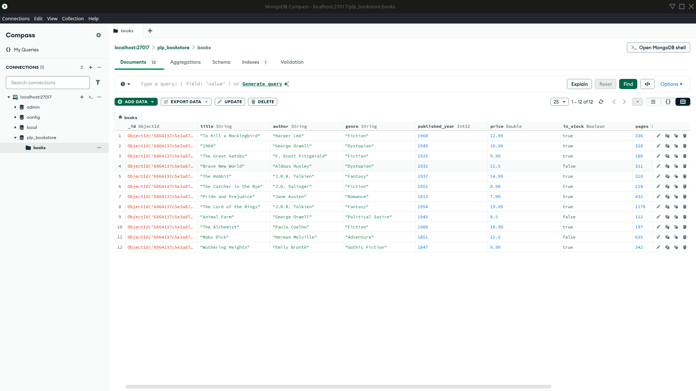

# 📚 PLP Bookstore - MongoDB Fundamentals Assignment

## ✅ Overview

This repository contains my Week 1 MongoDB Fundamentals assignment.
It covers:
- MongoDB setup
- CRUD operations
- Advanced queries
- Aggregation pipelines
- Indexing

## 🗂️ Files

- `insert_books.js` – Script to insert sample book data
- `queries.js` – MongoDB queries and pipelines
- `books_screenshot.png` – Screenshot of my collection in Compass

## ⚙️ How to Run

1. **Run insert_books.js**

   ``bash
   node insert_books.js
    ``
This will:

Connect to plp_bookstore

Drop any existing books collection

Insert the sample books

2. Open mongosh or Compass

3. Run queries

Open queries.js and copy/paste the commands to mongosh or run them in Compass.

# 🖼️ Screenshot

Below is a screenshot of my books collection in MongoDB Compass after running insert_books.js:

